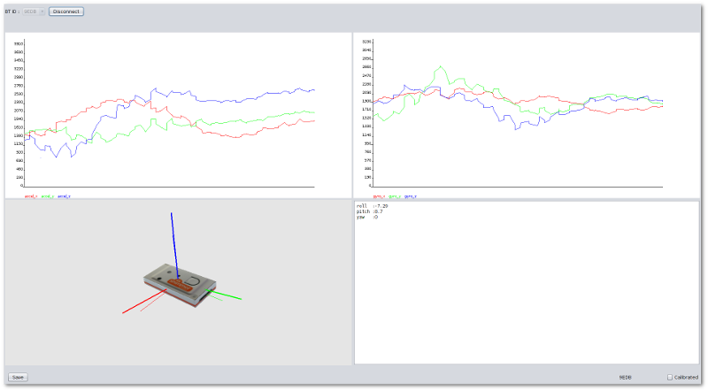
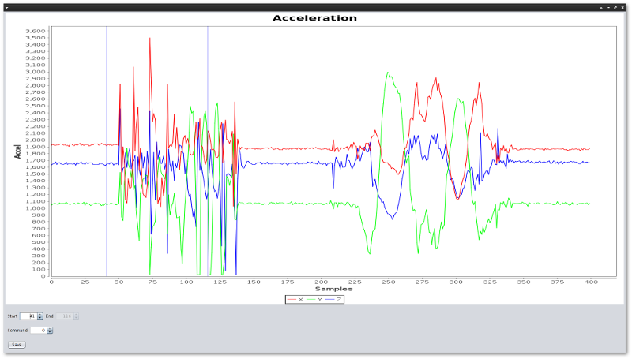

Shimmer Move Analyzer
.....................
To record gesture templates, the `ShimmerMoveAnalyzer` program can be used. It
allows one to stream accelerometer data from a Shimmer (with the Boilerplate firmware)
over Bluetooth. By clicking on the save button, the user can choose the data
window that will be saved to a text file to be used as a template later on.

Running
.......
This requires Java 1.7.

On Windows/OSX, bluecove (used for bluetooth communication) requires a 32bit JVM. So if you get a bluecove error when running, add the '-d32' option to the java command.

This does **not** work on OSX 10.9 due to the following bluecove issues :

http://stackoverflow.com/questions/21957282/bluecove-on-mac-os-10-9

https://code.google.com/p/bluecove/issues/detail?id=134

Credits
.......
Copyright 2013 HEIG-VD

Written by Grégoire Aubert and Julien Rebetez

With advices from Andres Perez-Uribe and Héctor Satizábal

License
.......
This program is free software: you can redistribute it and/or modify
it under the terms of the GNU General Public License as published by
the Free Software Foundation, either version 3 of the License, or
(at your option) any later version.

This program is distributed in the hope that it will be useful,
but WITHOUT ANY WARRANTY; without even the implied warranty of
MERCHANTABILITY or FITNESS FOR A PARTICULAR PURPOSE.  See the
GNU General Public License for more details.

You should have received a copy of the GNU General Public License
along with this program.  If not, see <http://www.gnu.org/licenses/>.
